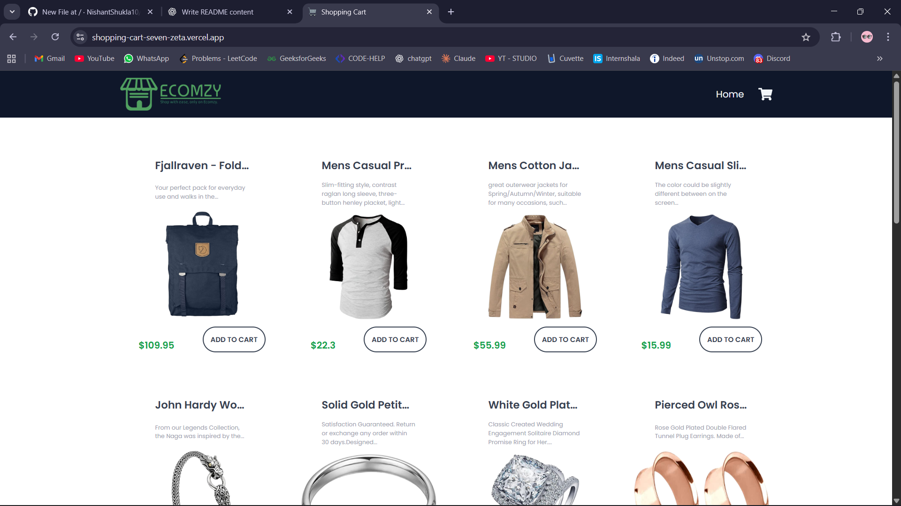
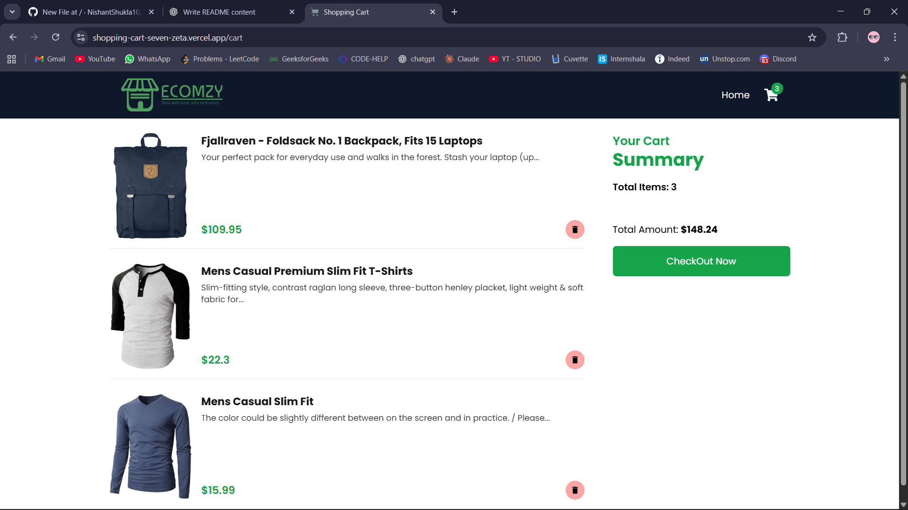

# Shopping Cart APP  

A modern online shopping cart built with **ReactJS**, **Redux Toolkit** and **Tailwind CSS**, designed to provide a smooth and enjoyable shopping experience.  

## ✨ Features  
- 🛍️ Browse products with a clean and responsive UI  
- ➕ Add, update, and remove products from the cart easily  
- 🔄 Centralized state management with **Redux Toolkit**  
- 🔔 Beautiful notifications using **React Toastify / React Hot Toast**  
- 🔗 Smooth navigation with **React Router DOM**  
- ⚡ Fast and responsive design powered by **Tailwind CSS**  

## 🚀 Tech Stack  
- **Frontend:** React
- **State Management:** Redux Toolkit 
- **Styling:** Tailwind CSS
- **UI Enhancements:** React Icons, React Toastify, React Hot Toast

## 🌐 Live Demo  
Check out the live version of this project here:  
👉 [Click here](https://shopping-cart-seven-zeta.vercel.app)

## ⚙️ Installation & Setup  

1. Clone the repository  
   ```bash
   git clone https://github.com/NishantShukla10/Shopping-cart.git
   cd Shopping-cart

2. Install dependencies
   ```bash
   npm install
   
3. Start the development server  
   ```bash
   npm start

4. Open in browser
   ```bash
   http://localhost:3000

## 📸 Screenshots

### Home Page


### Cart Page



## 🤝 Contributing  
Contributions, issues, and feature requests are welcome! 
